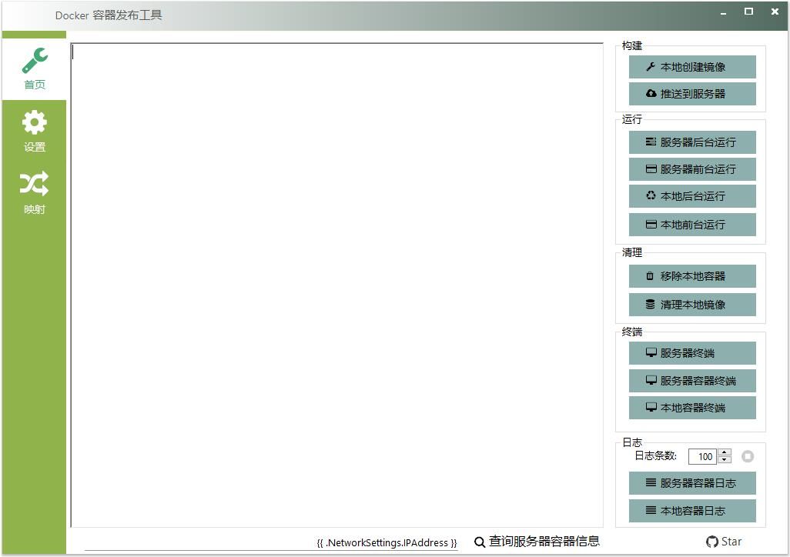

# PDocker
Docker 容器自动发布工具,  aardio / process.docker 扩展库演示程序。  
 [点这里下载 PDocker 发布版 ](./../../raw/main/dist/PDocker.7z) 体积仅 **1.2 MB**. 

这个程序以及 process.docker 扩展库的源码演示了在 aardio 中如何自动化部署 Linux 服务器，
以及通过进程管道后台调用命令行程序，如何为这类桌面工具轻松地编写美观的界面，生成简洁、小巧、并易于分发的软件。

